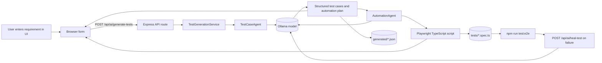
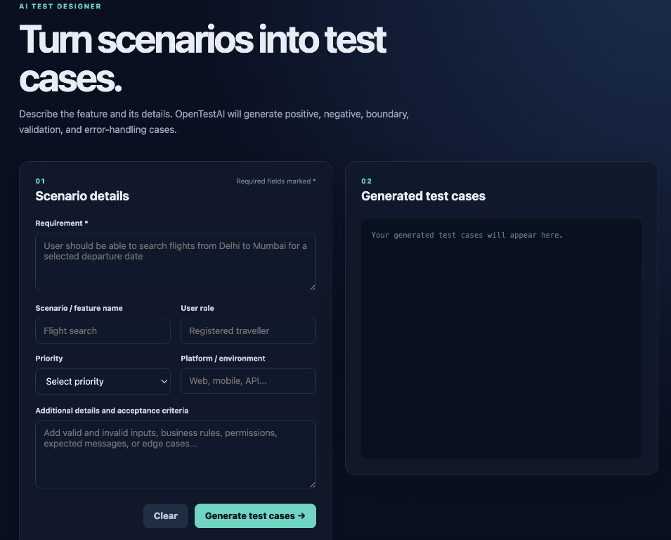
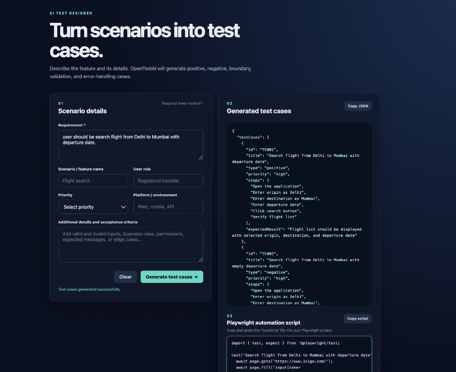

# OpenTestAI

OpenTestAI turns a plain-language requirement into structured test cases and a
Playwright automation script. It uses an Ollama-backed language model, exposes
an HTTP API, and includes a browser UI for creating and reviewing the results.

## What the application does

1. Accepts a requirement and optional scenario details.
2. Generates positive, negative, boundary, validation, and error-handling test
   cases.
3. Creates a Playwright TypeScript script from the generated test cases.
4. Saves both artifacts to a unique, timestamped path and returns them in the
   API response.
5. Provides a healing endpoint for a failing Playwright script.

## End-to-end flow



## Prerequisites

- Node.js 18 or newer
- Ollama running locally
- An Ollama model available locally (the default is `llama3.2`)

Install and prepare the model:

```bash
ollama serve
ollama pull llama3.2
```

## Setup and run

Install dependencies:

```bash
npm install
```

Optional environment variables:

```bash
export PORT=3000
export OLLAMA_BASE_URL=http://localhost:11434
export OLLAMA_MODEL=llama3.2
```

Start the application:

```bash
npm run dev
```

Open [http://localhost:3000](http://localhost:3000) in a browser. The health
check is available at [http://localhost:3000/health](http://localhost:3000/health).

## How to create test cases from the UI

1. Enter the main requirement, for example:
   `User should be able to search flights from Delhi to Mumbai for a selected departure date`.
2. Add the scenario name, user role, priority, platform, and acceptance criteria.
3. Select **Generate test cases**.
4. Review the generated JSON in the **Generated test cases** panel.
5. Review or copy the generated Playwright script in the **Playwright automation
   script** panel.
6. Run the saved script with the Playwright test command described below.

Every click sends a new request to Ollama with a unique generation token and a
nonzero sampling temperature. This intentionally creates a fresh variation
instead of returning or overwriting a previous test-case set. Each response
also gets a unique `generationId`, so repeated requests for the same
requirement produce separate files.

### UI screenshots

Initial form:



Generated test cases and Playwright script:



## API workflow

Generate test cases directly from the API:

```bash
curl -X POST http://localhost:3000/api/ai/generate-tests \
  -H "Content-Type: application/json" \
  -d '{
    "requirement": "User should be able to search flights from Delhi to Mumbai for a selected departure date"
  }'
```

The response contains:

- `data.testCases`: the generated test case collection
- `data.automationPlan`: framework, language, and high-level steps
- `data.playwrightScript`: a ready-to-copy TypeScript script
- `data.artifacts.json`: path to the saved JSON artifact
- `data.artifacts.playwrightScript`: path to the saved Playwright artifact

## Generated test case and script flow

Each generated case should describe the intent, type, priority, steps, and
expected result. The generated script translates those steps into executable
Playwright actions and assertions.

Example of the relationship:

```text
Test case: Search flight with a valid departure date
  Type: positive
  Steps:
    1. Open the application
    2. Enter Delhi as the origin
    3. Enter Mumbai as the destination
    4. Enter a valid departure date
    5. Submit the search
  Expected result: Matching flights are displayed

Playwright script:
  test("search flight with a valid departure date", async ({ page }) => {
    await page.goto("https://example.test");
    await page.getByLabel("Origin").fill("Delhi");
    await page.getByLabel("Destination").fill("Mumbai");
    await page.getByRole("button", { name: "Search" }).click();
    await expect(page.getByRole("list")).toBeVisible();
  });
```

The exact selectors and URL are generated from the requirement and should be
reviewed against the target application before execution.

## Running generated tests

The Playwright configuration starts the OpenTestAI server automatically and
uses `http://127.0.0.1:3000` as its base URL:

```bash
npm run test:e2e
```

To type-check the service:

```bash
npx tsc --noEmit
```

Generated artifacts are written to filenames containing the requirement slug,
a unique timestamp, and a random suffix:

```text
generated/<requirement-slug>-<generation-id>.json
tests/<requirement-slug>-<generation-id>.spec.ts
```

## Healing a failing test

Send the failing script, failure output, and optional context to:

```bash
curl -X POST http://localhost:3000/api/ai/heal-test \
  -H "Content-Type: application/json" \
  -d '{
    "script": "import { test, expect } from \"@playwright/test\";",
    "failure": " locator timeout",
    "context": "The submit button label changed."
  }'
```

The healing service asks Ollama for a corrected script or an explanation of
the required change.

## Project structure

```text
public/                 Browser UI
src/config/             Environment configuration
src/llm/                Ollama client and prompt builders
src/agents/             Test-case, automation, and healing agents
src/routes/             API endpoints
src/services/           Generation and healing orchestration
tests/                  Playwright end-to-end tests and generated scripts
generated/              Generated JSON test-case artifacts
docs/images/            README UI screenshots
```
